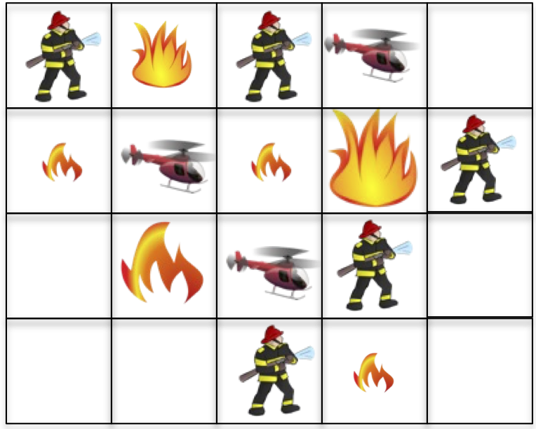
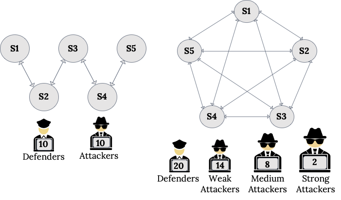
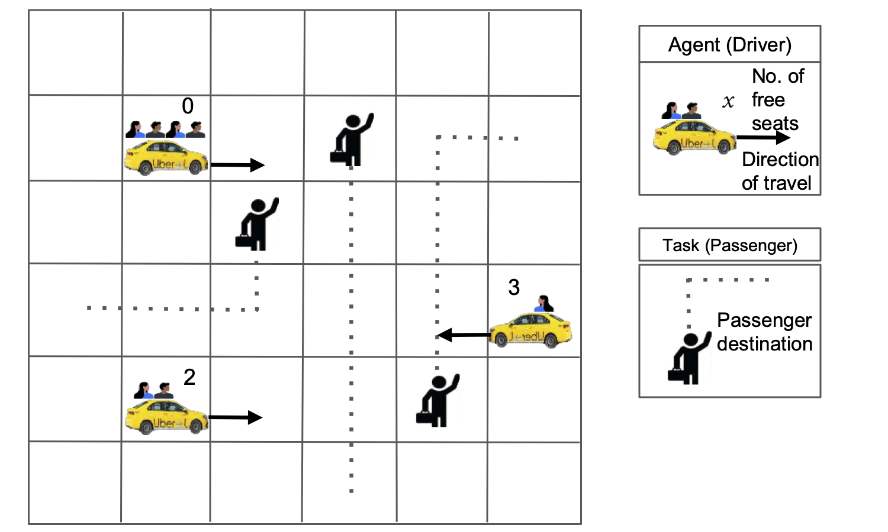
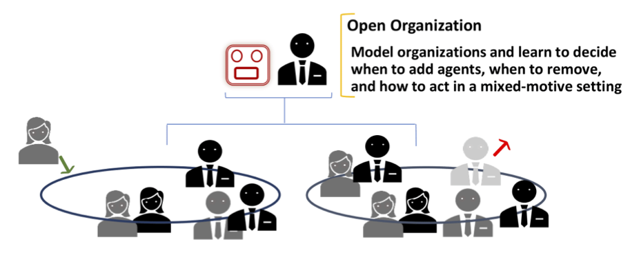

To illustrate how the different types of openness in OASYS manifest, consider the following four real-world applications:

# Robotic Wildfire Suppression

A team of cooperative firefighting robots are tasked with putting out wildfires of different sizes, in the absence of inter-agent communication or prior coordination. These characteristics are common in disaster areas where communication is not guaranteed, and emergent fast-moving situations could arise leading multiple firefighting teams to partake in the effort without prior coordination.  Agents can have different firefighting capabilities, such as ground firefighters with limited suppressant and helicopters that carry much more suppressant and contribute more to putting out fires but must also recharge more often.

Each agent has a limited amount of suppressant that it expends on a fire, so an agent must disengage and leave the environment to recharge its suppressant when it runs out.  This source of **agent openness** necessitates agent decision making that trades off suppressant usage in order to be available when agents can maximally impact the firefighting.  Simultaneously, each agent must also reason about the suppressant levels of its neighbors, which are unobservable to the subject agent, in order to predict if and when the neighbors will be available to help put out fires that are too large for any single agent to handle alone. Agent openness can be either **temporary** -- due to agents leaving the environment for only a short time to recharge limited suppressant -- or **permanent** -- as new squads of robots join the environment to help fight challenging fires or previous squads of robots leave as they are reallocated to other areas of interest.

Additionally, this environment can exhibit **task openness** as new fires appear in previously calm areas, which introduces new tasks different from the current set of fires the agents aim to suppress.  Tasks can also disappear as previous areas of concern are mitigated or fires burn out of control.

 
---
 

# Cybersecurity Defense

In this environment, defender agents are tasked with cooperating with one another to monitor the nodes within a computer network and patch vulnerabilities.  At the same time, a separate team of attacker agents instead work to exploit existing vulnerabilities and infect network nodes.  Both teams of agents (attackers and defenders) ultimately compete to gain control of the computer network, earning rewards based on the states of all nodes in the network.  For either team to be successful, its agents benefit from modeling the reasoning of its own team members and its adversaries in order to predict their behaviors and choose actions that are a best response to the expected actions of others.

**Agent openness** manifests in this environment in several ways.  In order to evade detection by the defenders, attackers occasionally leave the network before reappearing to continue threatening the security of the network.  Defenders might also be unavailable to take actions when the network nodes they are operating in are taken offline for repair, or for other reasons.  Thus, to be successful, both defenders and attackers must also predict when their team members and adversaries are present or absent in the environment.   Because of the combination of competition between teams and cooperation within teams, reasoning about the presence of neighbors in both teams is especially critical --  knowing when your teammates are available to collaborate while simultaneously exploiting weaknesses due to the non-availability of adversaries is vital to  both teams' success.

**Task openness** can also exist in this environment.  For example, the importance of different subnetworks might change over time (depending on the real-world operations utilizing those subnetworks), altering the rewards for patching (or infecting) each subnetwork and representing different tasks of prioritizing some subnetworks over others by both teams.  

**Type openness** can also occur as attackers gain new capabilities and can infect more nodes deeper in the network or with greater ability to infect particular nodes, and defenders can also gain new abilities in patching vulnerabilities as new defense tools become available.

 
---
 

# Autonomous Ridesharing

Agents controlling autonomous cars used for ridesharing are tasked with servicing human passengers seeking rides by picking each up from their pickup location and dropping them off at their drop location. Each driver is self-interested in maximizing its own reward for transporting passengers and can be modeled as being present in the environment when it is seeking or dropping off passengers, else they are absent from decision making while not working or have no room to take on new passengers (leading to **agent openness**).

Agents in the environment have access to information about their own locations on the grid and direction of travel, as well as some indication of the movements of other drivers.  They also know the pickup and drop locations of all waiting, accepted, and riding passengers.  However, new passengers (each representing a unique task) may appear at any time and drivers are unaware of their needs beforehand, leading to **task openness**.  For example, after a large entertainment event (e.g., a concert or sporting match), many passengers might need rides from similar pickup locations but with diverse drop off locations.  Or as evening starts, different numbers and types of passengers might need rides from many residential areas to restaurants and shops.  Thus, the set of tasks that drivers work to complete changes over time in both predictable and unpredictable ways, resulting in task openness.  Success for a driver as an agent in this domain requires anticipating which of the available passengers could other drivers pickup in order to decide which unattached passengers to try to pickup themselves, as well as where new passengers will appear in the near future to best position the driver to earn their fares.  

Notably, changes in tasks (i.e., passengers in the system) also cause changes in the set of actions available to agents -- new locations become relevant with new passengers for pickup and dropoff, while other actions would no longer be meaningful as previously relevant tasks are completed and thus disappear.  This creates novel challenges to planning and learning; the majority of prior methods for closed environments assume fixed action sets.

 
---
 

# Large Organizations

A typical business organization features a mix of (a) cooperation for achieving the overall improvement of the organization and (b) competition among individual employees.  Thus, an employee agent may have two sets of (perhaps conflicting) goals to optimize while contending with other employees.  That is, when an employee is involved in a team project, it needs to balance these (potentially conflicting) goals in order to maximize its expected rewards. This adds to the level of complexity not seen in the other three domains.  

**Agent openness** manifests due to new employees joining the organization and some existing ones either resigning or requesting to leave.  In addition, projects in the organization may get canceled due to economic headwinds and new projects often get allocated without much notice, which signifies **task openness**. Finally, **type openness** also manifests naturally with employees being promoted to new roles that endow them with expanded capabilities and modified preferences.  This further complicates agent reasoning as the state space under consideration increases exponentially due to the need to account for the increased uncertainty.  As such, a typical employee in a business organization must consider the impact of all three types of openness in its decision making (though perhaps not all at the same time), thereby significantly complicating its decision making.
