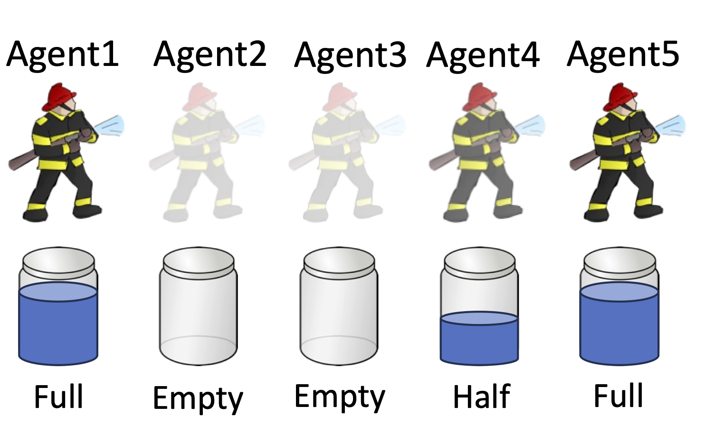
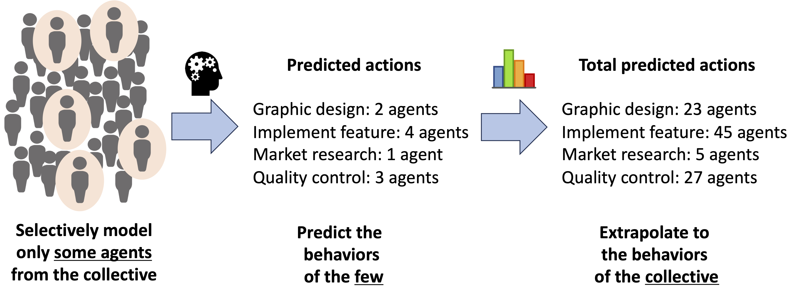

To achieve principled and scalable decision making in OASYS, we have developed the following solutions for multiagent planning and reinforcement learning.

# Modeling Agent Presence

To address the challenge of modeling **agent openness**, we describe an extension of the Interactive POMDP reasoning framework that augments the agent's decision-making state with a set of *presence states* for each agent -- both for itself and its neighbors -- to track agent openness, as illustrated in the figure above [(Chandrasekaran et al., 2016)](http://www.auai.org/uai2016/proceedings/papers/286.pdf).  At a minimum, each presence state represents a binary state of whether an agent is currently *present* or *absent* from the environment.  Depending on the domain, richer representations are also possible, such as levels of suppressant (e.g., "full", "half", "empty") held by agents in the wildfire fighting application.  By combining the environment state with a presence state variable for each agent in the MAS, the agent can differentiate the nuances of situations caused by agent openness.  

Because the exact presence of other agents might not be directly observed by the planning agent (and instead may only be *partially observable*), the planning agent maintains (1) a stochastic process model of how the presence of each agent changes based on their actions, and (2) a Bayesian probabilistic belief about the presence of each other agent over time.  We proposed an accompanying offline planning algorithm based on PBVI but extended to open multiagent settings to enable agents to plan behaviors when their set of neighbors changes over time in ways critical for maintaining collaborative success.

[Add text about RL solution]

 

 

# Scalability through Selectively Modeling Neighbors

One of the key challenges to scaling up to many-agent systems is that the **combinatorial explosion** of present vs. absent agents grows *exponentially* with the number of agents.   We addressed this challenge [(Eck et al., 2020)](https://aaai.org/ojs/index.php/AAAI/article/view/6200) through extrapolation based on statistical sampling, inspired by polling and public opinion modeling in the social sciences, illustrated above.  In particular, polling typically surveys the opinions of only a small subset of the target population of interest (e.g., a few thousand likely voters before a national election) yet creates estimates of the opinions of the entire population (e.g., millions of actual voters) with desired levels of precision (i.e., worst-case error bounds).  Similarly, a planning agent can choose to model (or probe) only some neighbors, then extrapolate their behaviors to estimate the total behaviors (i.e., chosen actions) of the entire MAS. 

By controlling how many neighbors are modeled, we established error bounds on (1) the population estimates of how many agents will perform each action, and (2) the resulting possible gap between the optimal sequence of actions and the agent's planned actions (i.e., regret).  By modeling just a select subset of the agent's neighbors, a planning agent in an OASYS can mitigate the exponential growth in the number of possible situations it will face while reasoning about the presence of other agents (necessary to address agent openness), especially because the number of neighbors a planning agent must model grows only *logarithmically* with the total number of agents in the many-agent system.

 

 

# Online Planning with MCTS

To complement our selective neighbor modeling, we also developed the first online algorithm for planning in OASYS [(Eck et al., 2020)](https://aaai.org/ojs/index.php/AAAI/article/view/6200), extending the popular POMCP algorithm to open multiagent systems.  Online planning further addresses the additional computational complexity of modeling the presence of neighbors by enabling the agent to make quick decisions about what is appropriate for situations that can result from its current situation, instead of needing to plan for all possible situations as in prior offline planning approaches to OASYS.  Experiment results expand on the theoretical analysis to demonstrate good decision making by planning agents in much larger multiagent systems (with up to 50 agents, an order-of-magnitude more than prior studies).

 

 

# Enhanced Collaboration through Communication

Description

 

 

# Fully Online Planning through Nested MCTS

Description

